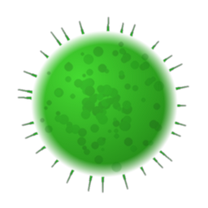

# PIA Polen (pia_pollen)

Home Assistant Integration for [Punto de Información Aerobiológica](https://aerobiologia.cat).

_PIA. Punto de Información Aerobiológica - Red Aerobiológica de Cataluña._  
_PIA. Punt d'Informació Aerobiològica - Xarxa Aerobiològica de Catalunya._  
_PIA. Point of Information on Aerobiology - Aerobiology Network of Catalonia._

## Instalación via HACS
1. Añadir este repositorio como repositorio custom en HACS
2. Buscar "PIA Polen" e instalar
3. Reiniciar Home Assistant
4. Ir a **Ajustes → Integraciones → Añadir integración** → buscar *PIA Polen*

## Sensores creados
Un sensor por taxón con `native_value` = nivel (0–4) y atributos:
`level_label`, `trend`, `trend_label`, `scientific`, `period_start`, `period_end`

## Características

* Sensores de nivel (native_value: 0–4) con level_label (Nulo/Bajo/Medio/Alto/Máximo)
* Tendencia como atributo (trend: A/=/D/!) con trend_label legible
* Pólenes y esporas, todos con scientific, code, type. 
* Metadatos de estación y período (station, period_start, period_end)
* Actualización cada 12h (datos semanales, suficiente)
* Config flow funcional desde la UI de HA

### Ubicaciones disponibles:

* Barcelona
* Bellaterra
* Girona
* Lleida
* Manresa
* Roquetes
* Tarragona
* Vielha
* Son
* Palma

### Idiomas disponibles:
* Castellano (por defecto)
* Catalán
* Inglés
